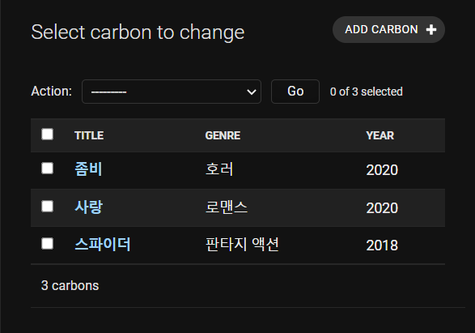
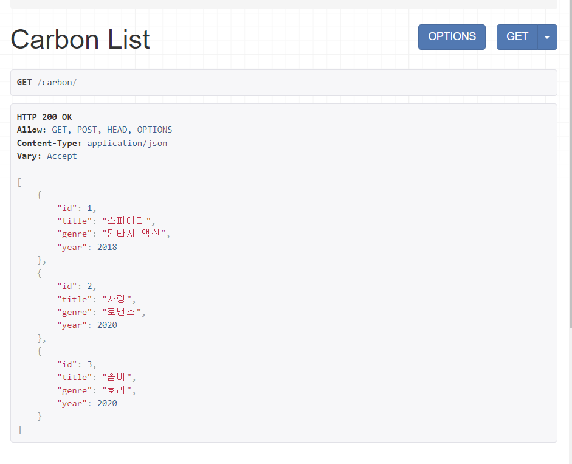
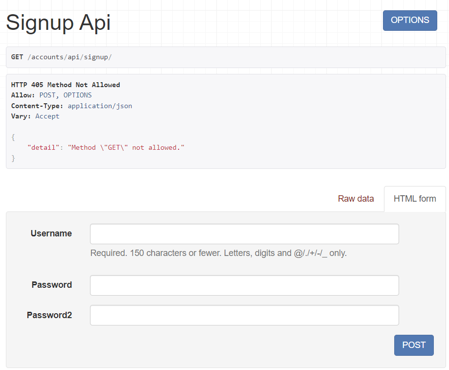

# mydjango

> 백엔드를 대표하는 python의 프레임워크의 버전인
> django를 이용하였고, django의 라이브러리중 하나
> react-framework를 설치하여 PUT,GET등을 습득하였습니다.

- 해당 admin 페이지 버전

- 해당 Carbon 페이지 변경 버전

- 해당 Account_SignUp 버전

도움 받은 링크: <https://www.django-rest-framework.org/?msclkid=6578d318bb9911ec9fa25e585882fd72>
 
python ./manage.py runserver
