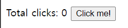
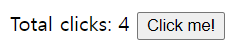
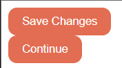

# react-for-beginners

> 자바스크립트를 시작하기 이전 HTML를 통해
> HTML에서 지원되는 것을 확인할 수 있었으며,
> DOM 및 virtual_DOM의 차이점을 확인을 하였습니다.

- 해당 index 페이지 버전

- 해당 index 페이지 변경 버전

- 해당 button의 스타일, react 버전

도움 받은 링크: <https://nomadcoders.co/dashboard>
 
index.html 및 vanilla.html 우클릭후 Open with Live Server
